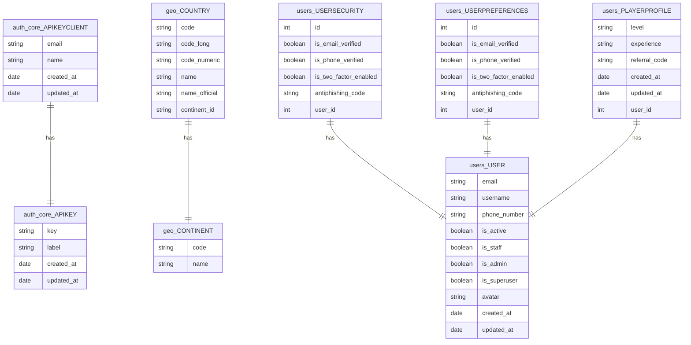

```mermaid
erDiagram
  %% AUTH_CORE
  auth_core_APIKEYCLIENT ||--|| auth_core_APIKEY : has
  auth_core_APIKEYCLIENT {
    string email
    string name
    date created_at
    date updated_at
  }
  auth_core_APIKEY {
    string key
    string label
    date created_at
    date updated_at
  }

  %% GEO
  geo_CONTINENT {
    string code
    string name
  }
  geo_COUNTRY ||--|| geo_CONTINENT : has
  geo_COUNTRY {
    string code
    string code_long
    string code_numeric
    string name
    string name_official

    string continent_id
  }
  %% USERS
  users_USER {
    string email
    string username
    string phone_number
    boolean is_active
    boolean is_staff
    boolean is_admin
    boolean is_superuser
    string avatar
    date created_at
    date updated_at
  }
  users_USERSECURITY ||--|| users_USER : has
  users_USERSECURITY {
    int id
    boolean is_email_verified
    boolean is_phone_verified
    boolean is_two_factor_enabled
    string antiphishing_code

    int user_id
  }
  users_USERPREFERENCES ||--|| users_USER : has
  users_USERPREFERENCES {
    int id
    boolean is_email_verified
    boolean is_phone_verified
    boolean is_two_factor_enabled
    string antiphishing_code

    int user_id
  }
  users_PLAYERPROFILE ||--|| users_USER : has
  users_PLAYERPROFILE {
    string level
    string experience
    string referral_code
    date created_at
    date updated_at

    int user_id
  }
```